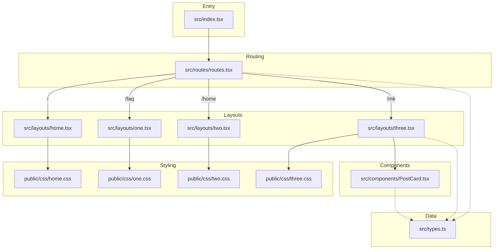

# Project Architecture & Connections

This diagram illustrates how the different parts of the project connect, from the entry point to the layouts and styles.

### How to View This Diagram

You can visualize this Mermaid diagram in several ways:

1.  **VS Code:** Install the **"Markdown Preview Mermaid Support"** extension. Then, open this file and press `Ctrl+Shift+V` to see the rendered graph.
2.  **GitHub:** GitHub natively renders Mermaid blocks in `.md` files. Just push this file to a repository to see it.
3.  **Mermaid Live Editor:** Copy the code block above and paste it into [Mermaid.live](https://mermaid.live/).

### Key Relationships

- **Entry Point**: `src/index.tsx` initializes the Hono application.
- **Routing**: `src/routes/routes.tsx` handles URL mapping to different layout components.
- **Layouts**: Each page has a dedicated layout file. Page **Two** is optimized for high performance (Semantic HTML + LCP optimizations), while Page **Three** (`/mk`) handles the dynamic filtering of trade posts.
- **Post Components**: `src/components/PostCard.tsx` is the reusable unit for displaying trade professionals.
