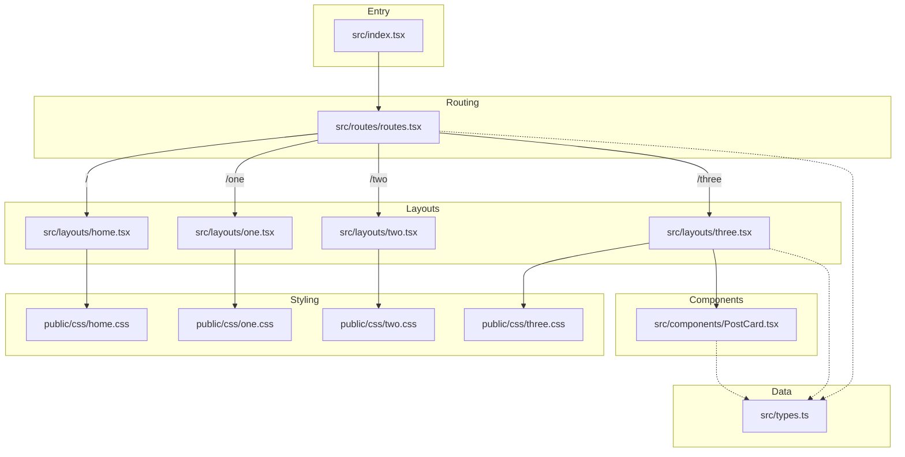

# Project Architecture & Connections

This diagram illustrates how the different parts of the project connect, from the entry point to the layouts and styles.

### Key Relationships

- **Entry Point**: `src/index.tsx` initializes the application.
- **Routing**: `src/routes/routes.tsx` handles URL mapping to different layout components.
- **Layouts**: Each page (Home, One, Two, Three) has its own layout file and dedicated CSS file in `public/css/`.
- **Page Three**: Specifically uses the `ParagraphPostCard` component (defined in `PostCard.tsx`) to display posts according to the site's maroon aesthetic.
- **Data Types**: `src/types.ts` defines the `Post` and `Comment` interfaces used throughout the application to ensure data consistency.
